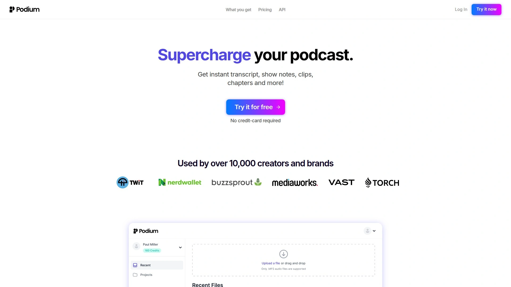

# 2025's Top 10 Best AI Content Repurposing Tools

Staring at hours of recorded content and wondering how you'll turn it into blog posts, social clips, and newsletters? That sinking feeling when you realize manual editing will eat up your entire week is all too familiar. AI content repurposing tools have changed the game completely—upload your podcast episodes, webinars, or video recordings once, and watch them transform into dozens of ready-to-publish assets across every platform you need. These platforms handle transcription, content generation, and format optimization automatically, letting you focus on creating instead of endless editing.

***

## **[Castmagic](https://www.castmagic.io)**

Transform one recording into 100 content assets with minimal effort.

Castmagic operates as an AI-powered content platform specifically built for teams and agencies drowning in audio and video files. The platform promises to cut editing and writing time from hours down to minutes, which sounds bold until you actually use it. Upload podcasts, recordings, Zoom calls, YouTube videos, or connect RSS feeds—basically anywhere your content lives—and Castmagic starts working immediately.

The AI automatically tags content by topic, speaker, theme, and campaign. This organization matters more than it sounds because semantic search makes every clip and topic instantly discoverable later. No more scrubbing through 45-minute recordings trying to find that one quote you remember. The system generates social posts, blog articles, show notes, reels, carousels, and more formats than you'll probably use, all scheduled directly to your channels or exported to your team.

Real users report impressive results: one community manager mentioned repurposing hundreds of hours of video and podcast content monthly, describing the experience as effortless. The platform claims users achieve 3x content output with a 70% reduction in content creation time. On average, clients save 80+ hours per engagement, which explains why content creators, agencies, and media operations have adopted it quickly.

The system handles imports from audio, video, YouTube, Vimeo, RSS, Instagram, Zapier, and additional sources. Integration flexibility means you can pull content from existing workflows without rebuilding everything. Plans are designed for fast-growing agencies, in-house teams, and large media operations, with pricing structured around volume and team size. According to independent reviews, Castmagic produced the most accurate transcripts with excellent speaker identification capabilities during head-to-head testing.

***

## **[Descript](https://www.descript.com)**

Edit audio and video by editing text—seriously, that simple.

Descript flips traditional editing on its head with transcription-based editing. Record your content, and Descript automatically transcribes everything into text. Want to remove a rambling section? Just delete the corresponding text in the transcript, and the audio file updates automatically. It feels like magic the first time you do it, especially if you've spent years learning timeline-based editors.

The filler word removal feature identifies and deletes "um" and "uh" sounds with a single click, instantly polishing your podcast without tedious manual work. Studio Sound enhances audio quality by reducing background noise and improving clarity, which saves remote recordings that would otherwise sound amateurish. Multitrack editing supports complex projects with multiple audio tracks for detailed professional work.

Overdub stands out as the most interesting AI feature—it creates a text-to-speech model of your own voice through AI voice cloning technology. This generates lifelike audio that sounds just like you, perfect for making quick corrections without re-recording entire segments. The tool handles both podcast and video editing, with screen recording capabilities and green screen effects for YouTube, TikTok, and other platforms.

The interface is intuitive and accessible even for beginners, though mastering advanced functionalities like multitrack editing and AI voice cloning requires time. Descript integrates with popular tools like Final Cut and Canva, enhancing versatility. Available on both Windows and Mac, the platform offers a free plan with basic features, though advanced capabilities and higher transcription limits require paid plans. The free plan includes a watermark on exported videos, which limits professional use.

***

## **[Repurpose.io](https://repurpose.io)**

Automated multi-platform distribution that actually works across channels.

Repurpose.io takes a different approach by focusing on automated content distribution rather than just generation. The platform transforms one piece of content into multiple formats optimized for different social media platforms without manual work. Think of it as a smart assistant that reformats your content to fit perfectly wherever you need it.

Workflow automation turns a single video into over 15 different pieces of content across multiple channels. For example, create a workflow that automatically takes every new TikTok video you post and republishes it to Instagram Reels, YouTube Shorts, and Facebook with the right size and format for each platform. The system handles technical details like changing video sizes from horizontal to square or vertical, adding your logo and branding, and including captions automatically.

Ready-made templates handle content conversion for video-to-video and audio-to-video formats, with customization options for brand colors and style. Auto Publish Scheduling spreads content over time instead of posting everything at once—set up to five different posting times each day with at least two hours between each post to avoid overwhelming your audience. Integration works seamlessly with major platforms including TikTok, YouTube, Instagram, Facebook, and LinkedIn.

The platform removes watermarks and offers customizable templates that match your brand identity. Pricing starts at $35/month for the Starter plan, with different levels based on content volume and platform needs. The tool requires some initial setup to configure workflows properly, and customization is somewhat limited compared to manual content creation. Best suited for creators who want distribution automation more than content generation.

***

## **[Opus Clip](https://www.opus.pro)**

Turn one long video into ten viral clips automatically.

Opus Clip specializes in transforming long-form videos into short, shareable clips optimized for social media virality. Upload a long video—whether it's an hour-long podcast or a 15-minute tutorial—and Opus Clip breaks it down based on what it categorizes as a virality score. This score ranks clips from 0 to 100 based on how likely they are to get views, not necessarily millions of views, but optimized engagement.

The AI uses GPT, OCR, and NLP to analyze your clip's content against social and marketing trends, identifying the most engaging moments automatically. Users typically select clips scoring 80 and above, then let Opus Clip automatically schedule them across platforms. One creator reported getting more views in September than in months prior simply by trusting the automated process and not overthinking content selection.

The platform generates roughly a dozen or more clips from each long video, with users reporting an 85% usability rate—meaning most clips are actually worth posting. Each clip can be edited within the tool to adjust cropping, aspect ratios, and captions before publishing. The workflow involves creating long-form content first, posting to YouTube, then copying the URL into Opus Clip to generate short-form versions.

Integration capabilities let you connect Opus Clip with automation tools like Zapier for streamlined workflows. The tool works particularly well for content creators who need to maximize reach across multiple platforms without manually editing dozens of clips. Pricing and exact features vary, but the platform has become popular among creators focused on repurposing existing content efficiently.

***

## **[Podium](https://hello.podium.page)**

AI copywriter built specifically for podcasters who hate writing show notes.

Podium targets podcasters specifically, generating show notes, transcripts, chapters, highlight clips, keywords, and social media posts from uploaded episodes. Powered by GPT-4, the tool analyzes podcast episodes and produces comprehensive, SEO-optimized show notes that summarize key points and break content into easily digestible chapters.

The Audio to Text functionality converts spoken content into accurate, searchable transcripts available in TXT and VTT formats, making episodes more accessible. AI-powered analysis provides valuable keyword insights to optimize content for better discoverability and improved search engine rankings. The highlight clips feature identifies the most engaging and shareable quotes from episodes with timestamp information, perfect for promoting content on social media.

Podium automates social media post creation, saving time and ensuring your audience stays engaged without manual effort. The platform can easily transform engaging podcast segments into clips without needing external tools, finding interesting content automatically. PodiumGPT, the podcast-specific language model, individualizes the experience based on your show's style and audience.

The interface is straightforward: upload your audio or video file, and Podium instantly starts generating written content including transcripts, titles, show notes, chapters, keywords, and highlights. You may need to wait a few minutes for processing depending on file length. The tool offers a free trial with no credit card or account required to test functionality. Paid plans provide additional features and processing capacity for regular podcasters.

---

## **[Swell AI](https://www.swellai.com)**

Turn podcasts and videos into every marketing channel imaginable.

Swell AI is designed specifically to automate repurposing of audio and video content into diverse marketing materials including transcripts, clips, show notes, articles, summaries, titles, newsletters, and social posts. The platform particularly serves podcasters, video creators, B2B marketers, and agencies managing multiple shows.

Content input flexibility is a major strength—connect RSS feeds, Apple Podcasts, YouTube links, Dropbox, or Google Drive to create a seamless content pipeline. The AI engine automatically generates full transcripts with speaker identification, handling various accents and speech speeds effectively. From a single file, you can generate detailed articles, time-stamped show notes, SEO-ready summaries, LinkedIn posts, Twitter threads, and newsletters.

The transcript editor allows highlighting sections to create shareable text or video clips, with an intuitive interface for selecting and cropping segments. AI suggestions offer recommendations to enhance content quality. Public sharing generates shareable links for distributing transcripts to teams or audiences. Content templates enable creation of reusable formats to boost efficiency.

The dashboard manages multiple podcasts or projects from a single interface, crucial for agencies and networks. Brand voice templates maintain consistent messaging across various content formats. The platform significantly reduces time and effort required for content creation while supporting scalability. However, there's a learning curve for novice users, and human intervention may be needed for strict brand standards. Integration limitations may exist depending on specific workflow requirements.

---

## **[Pictory](https://pictory.ai)**

Convert text into professional videos without any editing experience.

Pictory utilizes artificial intelligence to convert text into professional quality videos automatically. Upload a script, article, or blog post, and Pictory transforms it into a video with just a few clicks—no video editing experience required. The platform was built specifically for users intimidated by traditional video editing software.

Access to over 3 million high-quality video clips and images from Storyblocks comes included, normally a $30/month value on its own. This massive library provides royalty-free footage for virtually any topic. High-quality AI voice narration brings scripts to life, with automatic subtitle and caption generation. The ability to instantly resize content for YouTube, vertical shorts, and other social media platforms eliminates the tedious reformatting process.

The automated video creation saves enormous time by handling tedious tasks like editing footage, adding graphics, and recording voiceovers automatically. This enables rapid video production for creating more dynamic content faster. The intuitive interface requires no video, editing, design, or technical skills—just type a script or upload a blog post and let the AI work.

Videos are optimized using best practices to maximize viewership, shares, and engagement across social media platforms. Efficient scaling means anyone can produce unlimited videos cost-effectively since manual work is minimized. Customizable branding options let you personalize videos with brand colors, logos, and fonts through templates, creating consistent on-brand content that reinforces visual identity. The platform works entirely online with no software downloads required.

***

## **[Otter.ai](https://otter.ai)**

Live transcription and meeting notes that actually understand context.

Otter.ai has become the go-to transcription tool for meetings, lectures, interviews, and podcast sessions with its advanced AI speech-to-text technology. The platform delivers highly accurate speech recognition even in noisy environments or with multiple speakers. Automatic speaker identification and tagging creates organized, easy-to-follow conversation transcripts.

The free plan provides 300 minutes of transcription each month, making it accessible for individuals or project-based users. Upload existing audio or video files and Otter converts them to text automatically, or record live audio directly in the app. Supported formats include AAC, MP3, M4A, WAV, WMA, and even video files. Transcription typically takes the same amount of time as the audio length—a five-minute file transcribes in five minutes.

Otter AI Chat lets you ask questions about your transcripts and get instant answers, with automatic summaries of key points and action items from conversations. Use keywords to navigate transcripts quickly and share with teammates or collaborators. Export options include TXT, DOCX, PDF, or SRT formats for subtitles. The interactive editor makes it easy to correct specialized terms, assign precise speaker names, and highlight important sections.

Language support includes American and British English, Spanish, and French, with capability to handle a wide range of accents and regional dialects. The platform is SOC 2 Type 2 compliant with industry-standard encryption protecting your information. Mobile apps for iOS and Android let you record, upload files, and review transcripts directly from mobile devices. Paid plans start at $8.33 per month per user with additional features like advanced export options and team collaboration.

***

## **[Riverside.fm](https://riverside.fm)**

Record studio-quality podcasts and videos from anywhere with local recording.

Riverside.fm focuses on high-quality remote recording rather than just repurposing, though its recording quality makes downstream content repurposing much easier. The platform records podcasts and videos in studio-quality directly from your browser with no app downloads required. Local recording technology ensures freeze-free recordings with up to 4K video resolution and uncompressed 48kHz WAV audio for every participant.

Separate audio and video tracks for every participant provide more control in post-production editing. While recording, files automatically upload to the cloud. When the conversation ends, download all recorded files as separate tracks for maximum editing flexibility. The simple built-in editor lets you upload your logo, choose speaker layouts, edit full videos, and create promotional clips with just a few clicks.

Hosts easily invite guests or producers with a link and start recording—the browser-based platform lets guests join sessions with a single click without creating accounts. Hillary Clinton praised the platform, noting they needed a recording solution during the pandemic and Riverside stepped up. The interface is designed for simplicity, making it accessible even to non-technical podcasters.

AI-powered features streamline post-production workflows, and the platform integrates well with other editing and repurposing tools. Free plans offer basic recording capabilities, with paid plans unlocking advanced features like longer recording times, higher quality exports, and additional AI tools. Mobile apps for iOS and Android let you record and manage content on the go. Best suited for podcasters and video creators who prioritize recording quality over repurposing automation.

***

## **[Munch](https://www.getmunch.com)**

Extract the most engaging social clips from long videos automatically.

Munch maximizes ROI on long-form video content by extracting the most engaging and trending clips for social media using state-of-the-art AI. The platform uses computer vision and natural language processing to extract approximately 1,000 data points from any video, including deep analysis of gestures, faces, overlays, objects, spoken keywords, people, brands, locations, and topics.

These data points power the clip generation engine, taking into account coherence, excitement, and engagement metrics. The system matches content to marketing and trend analytics, determining the topic and trendability of each clip while writing the actual social media post. Direct sharing to channels happens from within the platform, streamlining the entire workflow.

The tool auto-generates short video clips from uploaded footage and conducts separate keyword research showing charts with top keywords, search volume, munched clips, and competition. Charts for top trending keywords, brands, people, and topics give better insights into which clips have the most viral potential. Manual fine-tuning options let you adjust cropping, aspect ratio, auto titles, and subtitles.

Magic Posts automatically creates captions with hashtags for social media accounts, editable before scheduling. The Publish Manager shows scheduled content for different platforms, with direct editing capabilities. Integration with TikTok, Instagram, and YouTube enables automatic posting across connected accounts. The platform is particularly useful for extracting engaging clips from podcasts, webinars, keynotes, broadcasts, and similar long-form content.

***

## FAQ

**How do AI content repurposing tools handle different audio quality levels?**

Most modern AI tools like Castmagic, Descript, and Otter.ai use advanced speech recognition that works well even with imperfect audio, though clearer recordings always produce better results. Tools like Descript include Studio Sound features that actually enhance audio quality by reducing background noise before transcription, which helps salvage recordings made in less-than-ideal conditions. For best outcomes, upload the highest quality source files you have available.

**Can these tools maintain my brand voice across different content formats?**

Yes, several platforms specifically address brand consistency—Swell AI offers brand voice templates that maintain uniform messaging across various formats, and Jasper integrates brand voice memory into its repurposing workflows. The key is feeding the AI examples of your existing brand content during initial setup and reviewing outputs initially to fine-tune the tone. Most tools improve accuracy as they learn your preferences over time.

**Do I need separate subscriptions for transcription and content generation?**

Not necessarily—comprehensive platforms like Castmagic, Swell AI, and Podium bundle transcription with content generation in single subscriptions, which is more cost-effective than piecing together multiple tools. However, if you only need transcription occasionally, standalone options like Otter.ai offer generous free tiers with 300 monthly minutes. The decision depends on your content volume and whether you need the full repurposing workflow or just specific features.

***

## Conclusion

The content repurposing landscape has matured significantly, with tools now handling everything from transcription to multi-platform distribution automatically. These platforms eliminate the painful choice between creating new content and properly promoting existing work—you can finally do both. [Castmagic](https://www.castmagic.io) stands out for teams and agencies managing high volumes of audio and video content who need comprehensive repurposing with minimal hands-on editing time. The combination of accurate transcription, automatic content generation across formats, and intelligent organization makes it particularly effective for anyone treating content creation as a scalable operation rather than a one-off project.
